## txt2img

:stars:将你喜欢的文字分享为多种样式的图片

注意，本脚本不负责**自动换行**，所以过长文本会超出图片，所以自己做好换行。另外，使用前记得解压缩 `assets/fonts.7z` 字体包。

### How to use

```Bash
>> git clone https://github.com/taseikyo/txt2img.git
>> cd txt2img
>> pip install -r requirements.txt
>> python txt2img.py -h
Usage: [-f <font path>] -t <pic style> -i 
        -w <some text> -u <user/title> -l <like count> -o <out img name>

Options:
  -h, --help       show this help message and exit
  -t PIC_STYLE     1: Mi-note style; 2~5: netease-cloud-music lyric style;6:
                   bilibili wallpaper style; 7: film style.
  -i IMG_FILE      image path
  -f FONT_FAMILY   truetype font path
  -w TEXT          some text you like
  -u USER          user name/title
  -o OUT_IMG_NAME  generated images name
```

### Preview and Examples

1. MI Note 小米便签

```Bash
>> python txt2img.py -w "我是天空里的一片云\n偶尔投影在你的波心\n你不必讶异\n更无须欢喜\n在转瞬间消灭了踪影\n\n你我相逢在黑夜的海上\n你有你的，我有我的，方向\n你记得也好\n最好你忘掉\n在这交会时互放的光亮\n" -u "徐志摩 《偶然》"
```

<div align="center">
	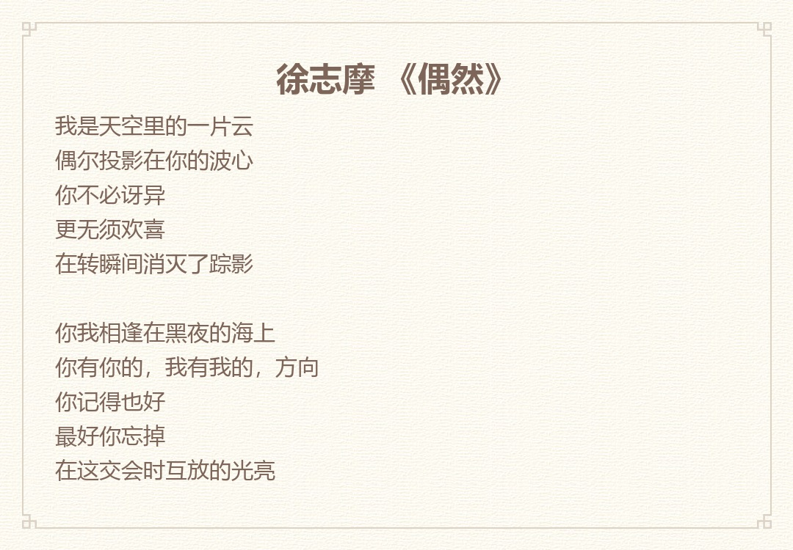
	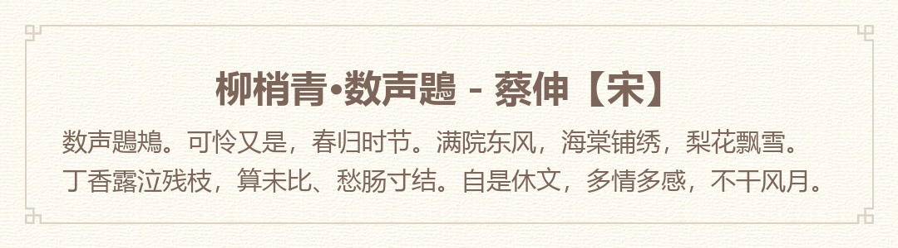
</div>

2. Netease Cloud Music Style 1 网易云音乐样式：朱砂

```Bash
>> python txt2img.py -t 2 -w "我曾难自拔于世界之大\n也沉溺于其中梦话\n不得真假 不做挣扎 不惧笑话\n我曾将青春翻涌成她\n也曾指尖弹出盛夏\n心之所动 且就随缘去吧" -u "起风了·买辣椒也用券"
```

<div align="center">
	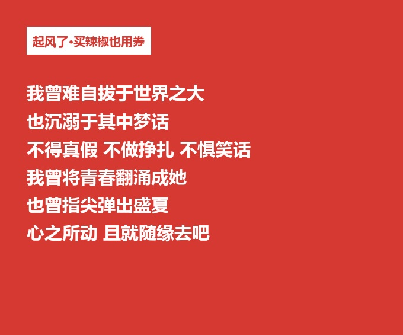
	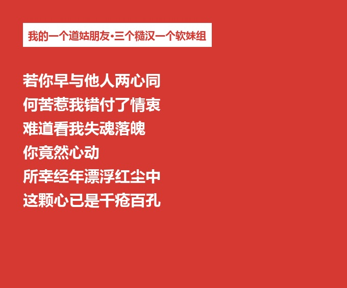
</div>

3. Netease Cloud Music Style 2 网易云音乐样式：信封

```Bash
>> python txt2img.py -t 3 -w "我曾难自拔于世界之大\n也沉溺于其中梦话\n不得真假 不做挣扎 不惧笑话\n我曾将青春翻涌成她\n也曾指尖弹出盛夏\n心之所动 且就随缘去吧" -u "起风了·买辣椒也用券"
```

<div align="center">
	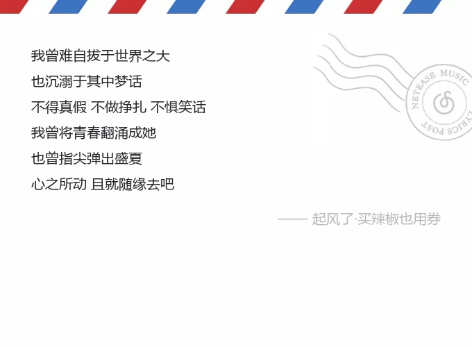
	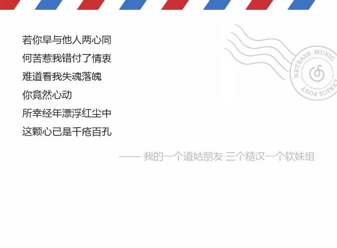
</div>

4. Netease Cloud Music Style 3 网易云音乐样式：古书

```Bash
>> python txt2img.py -t 4 -w "我曾难自拔于世界之大\n也沉溺于其中梦话\n不得真假 不做挣扎 不惧笑话\n我曾将青春翻涌成她\n也曾指尖弹出盛夏\n心之所动 且就随缘去吧" -u "起风了·买辣椒也用券"
```

<div align="center">
	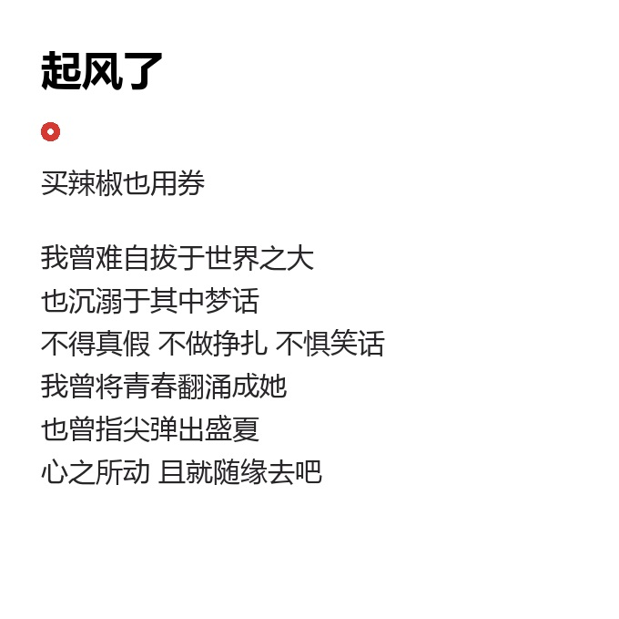
	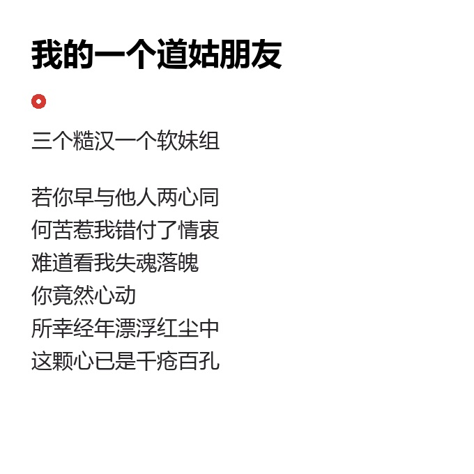
</div>

5. Netease Cloud Music Style 4 网易云音乐样式：磨砂

```Bash
>> python txt2img.py -t 5 -w "屋一间 窗半掩 爱和恨 穿针 引线，\n灯一盏 热汤一碗 岁月平淡 转眼 又过去一年，\n你的肩膀是屋檐 双手圈出 世界边缘，\n春雨 秋霜 夏蝉 掌心摩挲成茧 捧出一汪甘泉，\n神摧毁通天塔 只留下一个密码，\n名字叫做妈妈，\n这个音节统领了 所有动情的回答，孤单时念出它，\n希望过 失望过 潮起潮落 尝尽苦涩，\n哭喊过 挣扎过 心有灯火 微弱闪烁，\n不知我者 一笑而过，\n但知你如我 辗转反侧 心难割舍，\n好多话 开口变沙哑，\n黄沙 迎朝霞 百里荒漠 怒放出鲜花，\n所有 尖锐的都变铠甲 风很大 雨很急路很滑 请你保护她，\n等我 长大 等我 再回家 为你 梳理 白发。" -u "悲伤逆流成河" -i assets/悲伤逆流成河.jpg

>> python txt2img.py -t 5 -w "有人浅薄\nSome of us get dipped in flat\n有些人金玉其外\nsome in satin\n而败絮其中\nsome in gloss\n有一天你会遇到一个\nBut evry once in a while\n彩虹般绚丽的人\nyou find someone who's indescent\n当你遇到这个人以后\nand when you do,\n会觉得其他人只是浮云而已\nnothing will ever compare" -u "怦然心动" -i assets/怦然心动.jpg
```

<div align="center">
	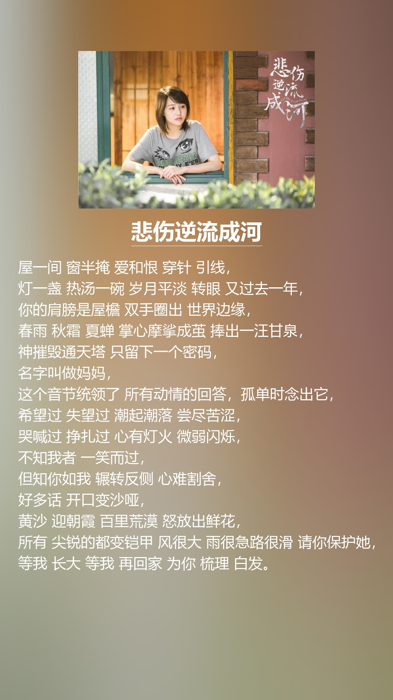
	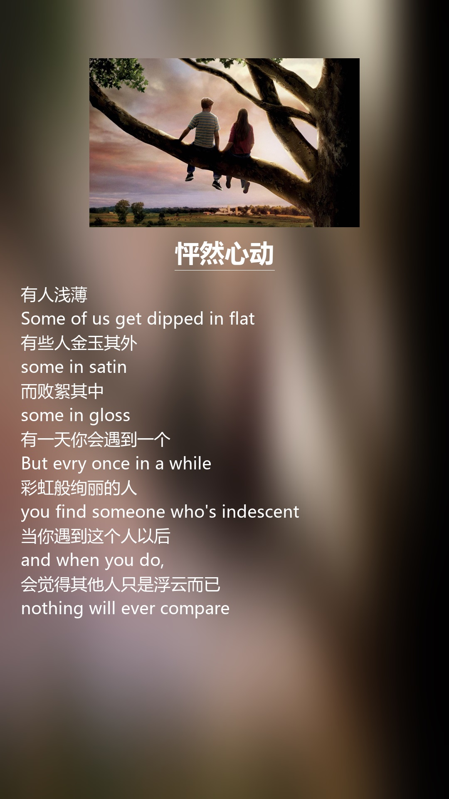
</div>

6. bilibili wall paper 哔哩哔哩壁纸(白/黑)

Original image: https://weibo.com/p/1006062854077297

```Bash
>> python txt2img.py -t 6 -i assets/bili_light.jpg -f assets/hylxj.ttf -w "你瞧这些白云聚了又散，\n散了又聚，人生离合，亦复如斯。" -u "神雕侠侣"

>> python txt2img.py -t 6 -i assets/bili_dark.jpg -f assets/hylxj.ttf -w "你瞧这些白云聚了又散，\n散了又聚，人生离合，亦复如斯。" -u "神雕侠侣"
```

<div align="center">
	
	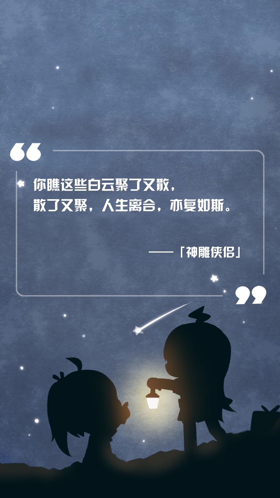
</div>

7. Film Style：电影台词样式

图片的尺寸应该是(840 * 1920)，或者与该尺寸成比例也行(420 * 960)

```Bash
>> python txt2img.py -t 7 -w "我的意中人是个盖世英雄，有一天他会踩着七色云彩来娶我，我猜中了前头可我猜不着这结局。" -i  assets/月光宝盒.png
>> python txt2img.py -t 7 -w "不是华北之大容不下一张平静的课桌，而是整个国家都危亡了，我们要去当兵。" -i assets/无问西东.png
```

<div align="center">
	
	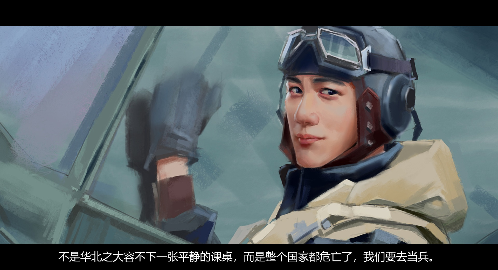
</div>

8. 豆瓣2019年度读书榜单书签

参考 [豆瓣2019年度读书榜单](https://book.douban.com/annual/2019) 书签样式 :3

```Bash
>> python douban2019.py -w "我会一直想你 但绝对不会找你 不会再重蹈覆辙 更不会再掉进你的深渊 或许我会回头看 但我绝对不会往回走" -u 我怀疑这奇遇只是恶作剧 -s 陈雪凝<别再靠近我了>
```

<div align="center">
	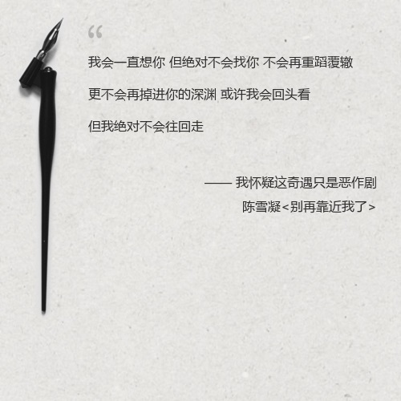
</div>

### References

- https://github.com/Urinx/NeteaseLyric
- https://www.liaoxuefeng.com/wiki/0014316089557264a6b348958f449949df42a6d3a2e542c000/0014320027235877860c87af5544f25a8deeb55141d60c5000
- https://pillow.readthedocs.io/en/latest/handbook/tutorial.html

### LICENSE

Copyright (c) 2018 Lewis Tian. Licensed under the MIT license.
