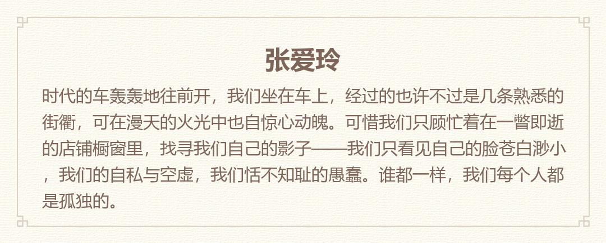
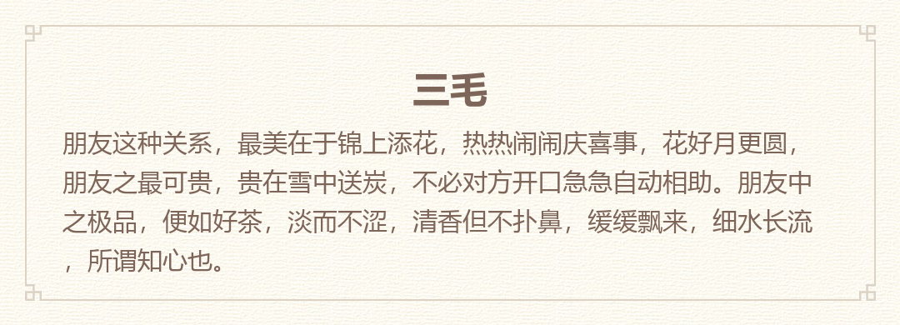

## txt2img
:stars:Share your text as a image.<br> 
:stars:将你中意的文字分享为多种样式的图片.

### How to use
```
>> git clone https://github.com/LewisTian/txt2img.git
>> cd txt2img
>> pip install -r requirements.txt
>> python txt2img.py --help
```
```
Usage: [-f <font path>] -t <pic style> -i 
        -w <some text> -u <user> -l <like count> -o <out img name>

Options:
  -h, --help       show this help message and exit
  -t PIC_STYLE     1: share text like MI note; 2: netease share image
  -i IMG_FILE      your own image
  -f FONT_FAMILY   truetype font file path
  -w TEXT          some text
  -u USER          user name
  -o OUT_IMG_NAME  generated images name[if not set, the name will be USER]
```


### Preview and Examples 
1. MI Note 小米便签

you'd better contain '\n' in your text, although I will cut your text into pieces if it is too long to put in a line (this may trigger error sometimes). Images save under folder img/.<br>
你最好在你的输入的文字中加入回车，虽然文字太长会被分割，分割的长度可能会有问题。

```
python txt2img.py -w "我是天空里的一片云\n偶尔投影在你的波心\n你不必讶异\n更无须欢喜\n在转瞬间消灭了踪影\n\n你我相逢在黑夜的海上\n你有你的，我有我的，方向\n你记得也好\n最好你忘掉\n在这交会时互放的光亮\n" -u "徐志摩 《偶然》"
```
<div align="center">
	
	
</div>

2. Netease Cloud Music Style 1 网易云音乐样式：朱砂

please contain '\n' in your lyric, I won't cut your lyric. <br>
请自行在输入的歌词中包含回车，在这个样式中我去掉了上述的分割功能。
```
python txt2img.py -t 2 -w "我曾难自拔于世界之大\n也沉溺于其中梦话\n不得真假 不做挣扎 不惧笑话\n我曾将青春翻涌成她\n也曾指尖弹出盛夏\n心之所动 且就随缘去吧" -u "起风了·买辣椒也用券"
```
<div align="center">
	
	
</div>


### Preferences
- https://github.com/Urinx/NeteaseLyric
- https://www.liaoxuefeng.com/wiki/0014316089557264a6b348958f449949df42a6d3a2e542c000/0014320027235877860c87af5544f25a8deeb55141d60c5000
- https://pillow.readthedocs.io/en/latest/handbook/tutorial.html

### LICENSE
Copyright (c) 2018 Lewis Tian. Licensed under the MIT license.